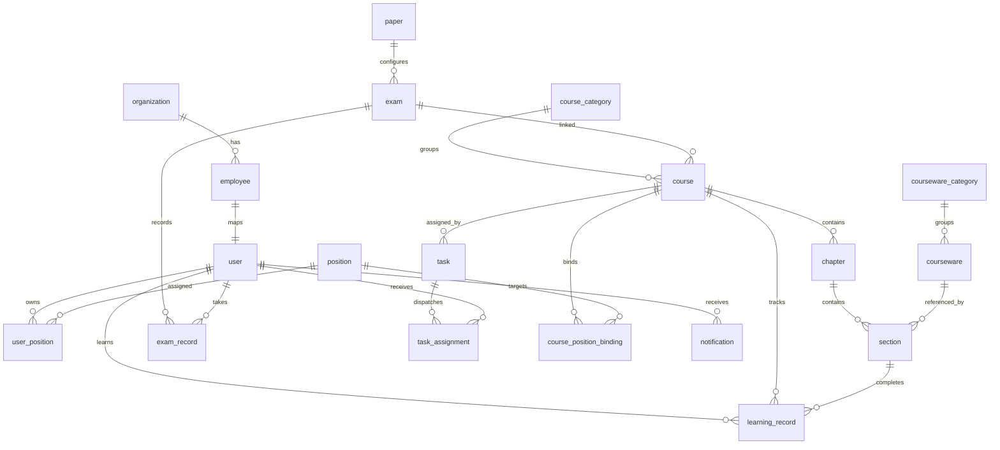

# LMS 培训闭环 V0.1 数据库模型

## 1. 建模范围

本模型服务于 V0.1 的岗位相关自学课程与课程考试闭环，覆盖厂端管理员维护课程资源、任务推送，以及学员学习、考试、评分记录。培训报名、签到、晋升、审批不在本版本范围内。

## 2. ERD

## 3. 枚举

| 枚举 | 值 |
|---|---|
| organization.type | factory, store |
| employee.status / user.status | active, inactive |
| user.user_type | admin, student |
| courseware.type / section.content_type | video, article, document, 3d |
| publish_status | draft, published, archived |
| question.type | single, multiple, judge |
| question.difficulty | easy, medium, hard |
| exam.status | draft, published, ended |
| exam_record.status | pending, submitted, passed, failed |
| learning_record.status | learning, completed |
| task.status | not_started, active, ended, closed |
| notification.type | course_task, exam_task |

## 4. 表结构

### organization

| 字段 | 类型 | 约束 | 说明 |
|---|---|---|---|
| id | bigint | PK | 主键 |
| name | varchar(120) | not null | 组织名称 |
| code | varchar(64) | not null, unique | 组织编码 |
| type | varchar(24) | not null | factory/store |
| parent_id | bigint | FK organization.id | 上级组织 |

索引：`idx_organization_parent_id(parent_id)`。

### employee

| 字段 | 类型 | 约束 | 说明 |
|---|---|---|---|
| id | bigint | PK | 主键 |
| name | varchar(80) | not null | 姓名 |
| employee_no | varchar(64) | not null, unique | 工号 |
| phone | varchar(32) | not null | 手机号 |
| organization_id | bigint | FK organization.id, not null | 所属组织 |
| status | varchar(24) | not null | active/inactive |

索引：`idx_employee_org_status(organization_id, status)`。

### user

| 字段 | 类型 | 约束 | 说明 |
|---|---|---|---|
| id | bigint | PK | 主键 |
| name | varchar(80) | not null | 用户名 |
| employee_id | bigint | FK employee.id, unique, not null | 关联员工 |
| user_type | varchar(24) | not null | admin/student |
| status | varchar(24) | not null | active/inactive |

索引：`idx_user_type_status(user_type, status)`。

### position / user_position

| 表 | 关键字段 |
|---|---|
| position | `id` PK, `name` varchar(80), `code` varchar(64) unique, `position_type` varchar(64), `level` varchar(32) |
| user_position | `id` PK, `user_id` FK, `position_id` FK, `is_primary` boolean |

约束：`uk_user_position(user_id, position_id)`；索引：`idx_user_position_user(user_id)`。

### courseware_category / courseware

| 表 | 关键字段 |
|---|---|
| courseware_category | `id` PK, `name` varchar(120), `parent_id` FK, `sort_order` int |
| courseware | `id` PK, `name`, `code` unique, `type`, `url`, `duration`, `cover`, `is_required`, `category_id` FK, `status` |

索引：`idx_courseware_category_status(category_id, status)`。

### course_category / course / chapter / section

| 表 | 关键字段 |
|---|---|
| course_category | `id` PK, `name`, `parent_id` FK, `sort_order` int |
| course | `id` PK, `name`, `code` unique, `cover`, `description`, `category_id` FK, `exam_id` FK, `status`, `created_by` FK user.id |
| chapter | `id` PK, `course_id` FK, `name`, `sort_order`, `is_exam_required` |
| section | `id` PK, `chapter_id` FK, `name`, `sort_order`, `content_type`, `courseware_id` FK |

约束：`uk_chapter_order(course_id, sort_order)`、`uk_section_order(chapter_id, sort_order)`。
索引：`idx_course_category_status(category_id, status)`、`idx_section_courseware(courseware_id)`。

### question / paper / exam

| 表 | 关键字段 |
|---|---|
| question | `id` PK, `content` text, `type`, `options` json, `answer` json, `analysis` text, `difficulty`, `category_id`, `status` |
| paper | `id` PK, `name`, `total_score`, `question_count`, `status` |
| paper_question | `id` PK, `paper_id` FK, `question_id` FK, `score`, `sort_order` |
| exam | `id` PK, `name`, `paper_id` FK, `pass_score`, `duration`, `limit_count`, `status` |

索引：`idx_question_type_status(type, status)`、`idx_exam_paper_status(paper_id, status)`。

### learning_record / exam_record

| 表 | 关键字段 |
|---|---|
| learning_record | `id` PK, `user_id` FK, `course_id` FK, `chapter_id` FK, `section_id` FK, `progress`, `status`, `last_learn_time` |
| exam_record | `id` PK, `exam_id` FK, `user_id` FK, `score`, `status`, `exam_time`, `attempt_number` |

约束：`uk_learning_user_section(user_id, section_id)`、`uk_exam_attempt(exam_id, user_id, attempt_number)`。
索引：`idx_learning_user_course(user_id, course_id)`、`idx_exam_record_user_exam(user_id, exam_id)`。

### course_position_binding / task / task_assignment / notification

| 表 | 关键字段 |
|---|---|
| course_position_binding | `id` PK, `course_id` FK, `position_id` FK |
| task | `id` PK, `name`, `course_id` FK, `start_time`, `end_time`, `status`, `created_by` FK user.id |
| task_assignment | `id` PK, `task_id` FK, `user_id` FK |
| notification | `id` PK, `user_id` FK, `type`, `title`, `content`, `is_read`, `send_time` |

约束：`uk_course_position(course_id, position_id)`、`uk_task_assignment(task_id, user_id)`。
索引：`idx_task_time_status(start_time, end_time, status)`、`idx_notification_user_read(user_id, is_read)`。

## 5. 关键规则落库说明

- 学习顺序由 `chapter.sort_order` 与 `section.sort_order` 决定，前端和后端均应按排序字段判断解锁。
- 课程考试资格由 `learning_record` 中课程全部小节完成状态推导，不单独存冗余资格字段。
- 考试限次由 `exam.limit_count` 与 `exam_record.attempt_number` 校验。
- 任务触达可由岗位课程绑定生成候选学员，再写入 `task_assignment` 与 `notification`，便于审计和补发。
- 外部试卷可通过 `paper` 和 `paper_question` 镜像基础信息；如完全由外部系统管理，可保留 `external_paper_id` 扩展字段。
